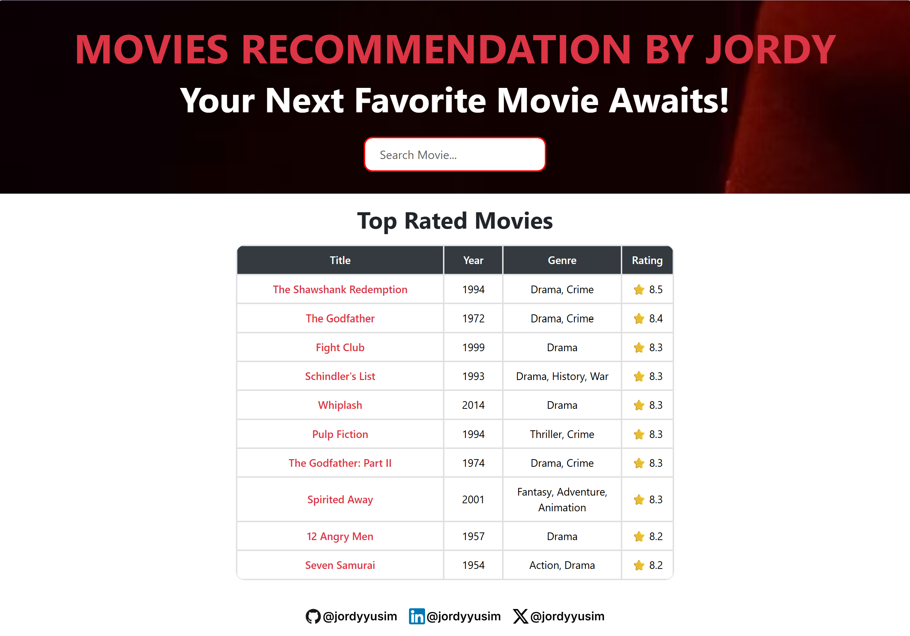
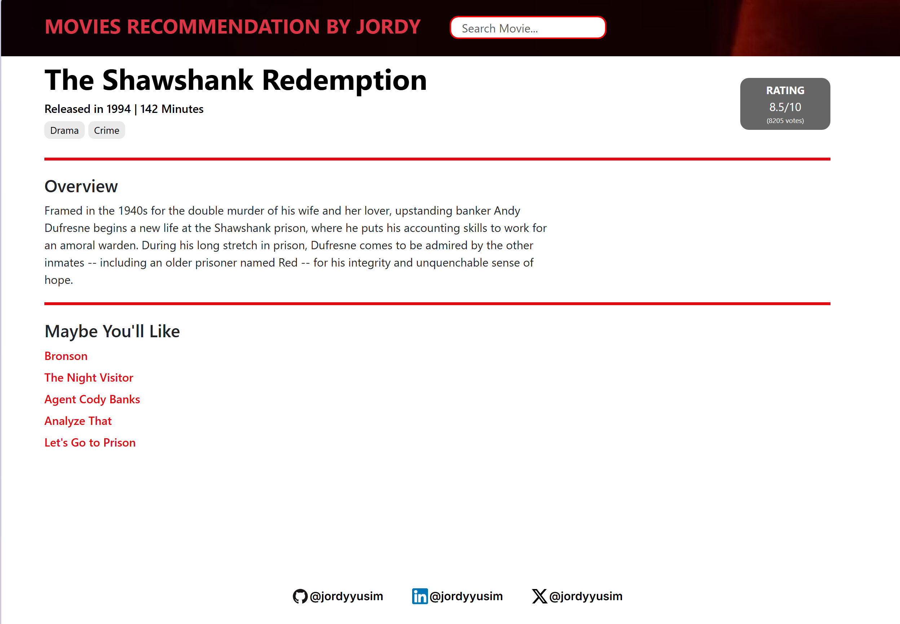

# 🎬 Movie Recommendation System

A machine learning project that recommends movies based on user preferences using **content-based filtering** and **weighted rating**. This system analyzes movie metadata such as genres and keywords to generate similar movie suggestions.
Built with **Python** and deployed as a web application using **Django**.

## 🌟 Features

- Shows top rated movies on home page.
- Recommends similar movies based on searched movie title.
- Display movie's details including release year, duration, genre, rating, and overview.
- Clean and minimal web interface powered by Django.
- Returns a 404-style error page if the movie does not exist in the database.

## 🌟 Steps

- Import Libraries
- Import Datasets
- Feature Cleaning
- Uses **TF-IDF Vectorization** on movie genre and keywords.
- Ranks movies using **Weighted Rating** (similar to IMDb formula).
- Shows recommended movies

## 📸 Screenshots





## 🛠️ Built With

- Python
- Django
- Pandas

## 📦 Installation

1. **Clone the repository**:

    ```bash
    git clone https://github.com/jordyyusim/movie-recommendation-system.git
    cd movie-recommendation-system
    ```

2. **Create a virtual environment**:

    ```bash
    python -m venv yourenv
    source yourenv/bin/activate      # On Windows: yourenv\Scripts\activate
    ```

3. **Install the dependencies**:

    ```bash
    pip install -r requirements.txt
    ```

4. **Run the development server**:

    ```bash
    python manage.py runserver
    ```

5.  **Run the app**:
    ```bash
    Open [`http://127.0.0.1:8000/`](http://127.0.0.1:8000/) in your browser
    ```

## 📬 Socials

[GitHub](https://github.com/jordyyusim) &nbsp;|&nbsp;
[LinkedIn](https://linkedin.com/in/jordyyusim) &nbsp;|&nbsp;
[X](https://x.com/jordyyusim)
